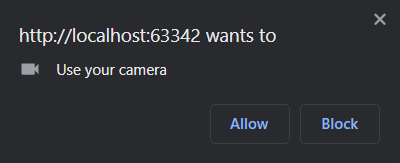
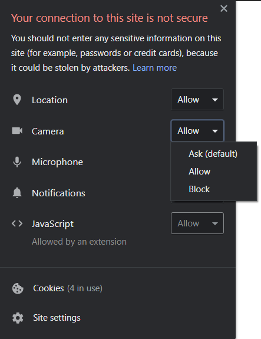

# camera-sample
A sample project to explore the camera feature.

### API(s)
+ MediaStream

### Instructions
+ If it is your first time running this example, you are asked to grant/deny the camera permission to the
 browser.
    
+ If you click `Allow`, the image recorded by the webcam/front camera will appear in the screen.
+ If you click `Block`, an error alert will pop up.
+ You can still make the camera permission popup appear by clicking on the Info button near the page URL and
 setting that permission properly. To apply the update, reload the page.
    
+ Click the camera button to take a picture or choose one from the file explorer/camera roll, and it will be displayed.

### Notes
+ The project has been tested on
    + Google Chrome 87 (both Desktop and mobile)
    + Mozilla Firefox 83 (both Desktop and mobile)

### Documentation and useful resources
+ [MediaStream API](https://developer.mozilla.org/en-US/docs/Web/API/Media_Streams_API)
+ [Taking still photos with WebRTC](https://developer.mozilla.org/en-US/docs/Web/API/WebRTC_API/Taking_still_photos)
    + [Live demo](https://mdn-samples.mozilla.org/s/webrtc-capturestill/)
    + [Source code](https://github.com/mdn/samples-server/tree/master/s/webrtc-capturestill)
